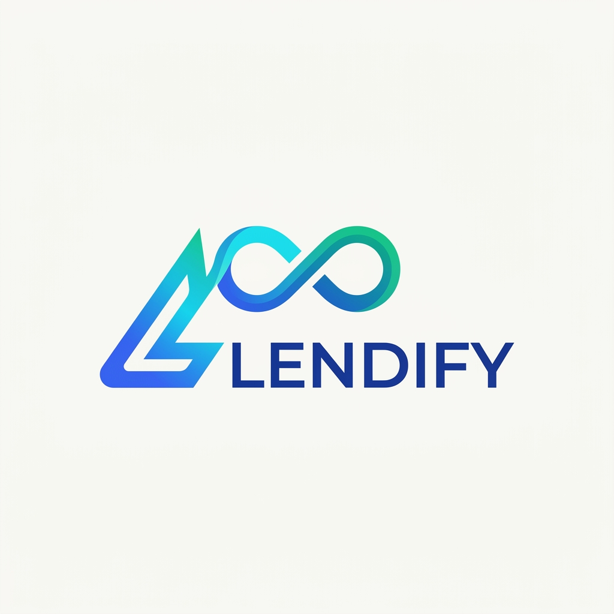
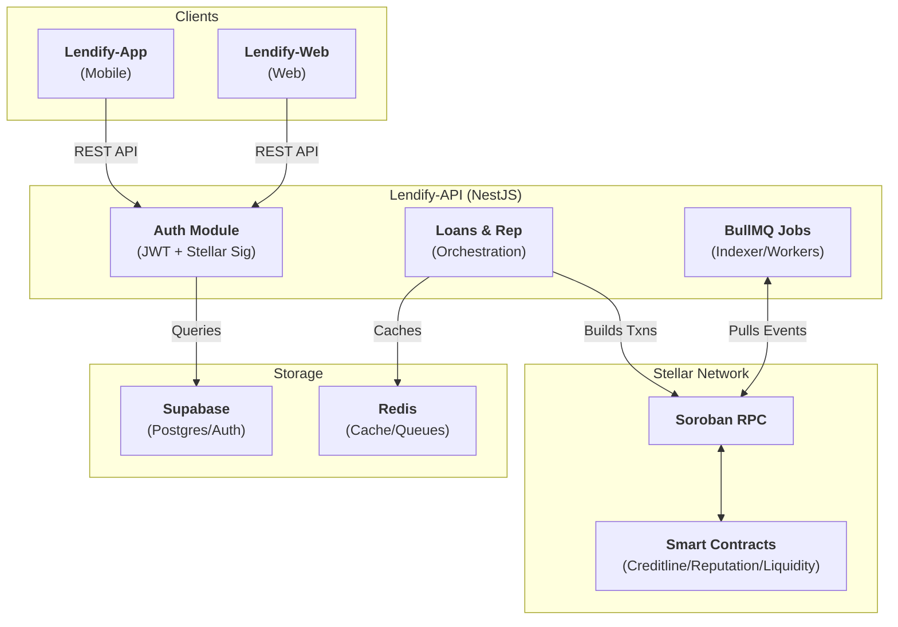

<div align="center">

# Lendify-API



[](https://nestjs.com)
[](https://www.typescriptlang.org/)
[](LICENSE)
[](https://github.com/Lendify-Onchain-Org/Lendify_service/actions)

**The off-chain brain of Lendify — auth, orchestration, indexing, and background jobs for reputation-based credit on Stellar.**

</div>

Lendify-API is a NestJS backend system for secure, decentralized management of reputation-based uncollateralized loans on the Stellar blockchain using Soroban smart contracts. The project enables learners and interns to build an on-chain reputation score, while sponsors fund a shared liquidity pool to support their growth. Built specifically to orchestrate loans, transactions, and off-chain data for the Lendify ecosystem.

The platform provides a comprehensive off-chain orchestration layer that turns wallet signatures into sessions, builds and tracks Soroban transactions, indexes on-chain state, and runs the scheduled jobs that keep everything in sync between the clients and the smart contracts.

---

## Table of Contents

- [Project Overview](#-project-overview)
- [Setup Instructions](#-setup-instructions)
  - [Prerequisites](#-prerequisites)
  - [Quick Start](#-quick-start)
  - [Environment Setup](#-environment-setup)
  - [Running Tests](#-running-tests)
- [Features](#-features)
- [Architecture & Tech Stack](#-architecture--tech-stack)
- [Project Structure](#-project-structure)
- [Usage Examples](#-usage-examples)
- [Deployment](#-deployment)
- [CI/CD Pipeline](#-cicd-pipeline)
- [Helpful Links](#-helpful-links)
- [Contribution Guidelines](#-contribution-guidelines)
- [License](#-license)
- [Support](#-support)

---

## Project Overview

Lendify extends small, uncollateralized loans to learners and interns based on an **on-chain reputation score** rather than assets. Sponsors fund a shared liquidity pool; borrowers draw loans sized and priced by their reputation, repay in installments, and grow their score. All money and trust live in Soroban smart contracts on Stellar.

### Key Benefits

| Benefit | Description |
|---------|-------------|
| **Wallet-Signature Auth** | Passwordless authentication using Stellar wallet (Ed25519) |
| **Reputation-based Credit** | Reads on-chain scores to map credit limits and APRs |
| **Seamless Orchestration** | Builds and tracks request/approve/fund/repay transactions |
| **Background Indexing** | Workers index chain events and reconcile status off-chain |
| **Observability** | Structured Pino logs, Prometheus metrics, and Sentry tracking |

### Target Users

- Learners and Interns (Borrowers)
- Sponsors (Liquidity Providers)
- Vendors and Mentors
- Ecosystem Partners

---

## Setup Instructions

### Prerequisites

Before you begin, ensure you have the following installed:

- **Node.js** - ≥ 20 (matches CI)
- **npm** - ≥ 10
- **Redis** - For BullMQ jobs & caching
- **Supabase project** - For database + storage authentication

### Quick Start

Get up and running locally:

```bash
# Clone the repository
git clone https://github.com/Lendify-Onchain-Org/Lendify_service.git
cd Lendify_service

# Install dependencies
npm install

# Copy environment variables template
cp .env.example .env

# Run the development server
npm run dev
```

### Environment Setup

Update your `.env` file with the required configuration:

| Variable | Purpose |
|----------|---------|
| `PORT` · `API_PREFIX` · `ALLOWED_ORIGINS` | HTTP server & CORS |
| `SUPABASE_URL` · `SUPABASE_ANON_KEY` · `SUPABASE_SERVICE_ROLE_KEY` | Supabase access |
| `DATABASE_URL` | Postgres connection |
| `REDIS_URL` | BullMQ queues & cache |
| `JWT_SECRET` · `JWT_REFRESH_SECRET` | Token signing |
| `AUTH_CHALLENGE_DOMAIN` | Domain bound into the signing challenge |
| `STELLAR_NETWORK_PASSPHRASE` · `STELLAR_HORIZON_URL` · `STELLAR_SOROBAN_URL` | Stellar network connection |
| `CREDITLINE_CONTRACT_ID` · `REPUTATION_CONTRACT_ID` · `LIQUIDITY_POOL_CONTRACT_ID` | Deployed contract IDs |
| `SENTRY_DSN` · `SENTRY_TRACES_SAMPLE_RATE` | Error tracking (optional) |

> **Note:** Never commit real secrets. `.env` is git-ignored; only `.env.example` is tracked.

### Running Tests

Ensure everything is working correctly:

```bash
# Run unit tests
npm test

# Run tests with coverage
npm run test:cov

# Run end-to-end tests
npm run test:e2e
```

---

## Features

- **Wallet-signature auth**: Challenge/nonce signed by Stellar wallet (Ed25519) to mint JWT access/refresh pairs.
- **Loan & credit orchestration**: Builds transactions against the Creditline contract and tracks lifecycles.
- **Reputation scoring**: Reads on-chain scores and caches them for credit decisioning.
- **Liquidity & Vouching**: Manages sponsor pool deposits, merchant onboarding, and mentor vouches.
- **Indexing & Jobs**: BullMQ and Redis index chain events, refresh caches, and reconcile transactions.
- **Security**: Hardened with helmet, rate limiting, and passport-jwt guards.

---

## Architecture & Tech Stack



| Layer | Choice |
|-------|--------|
| Framework | NestJS `11` on the **Fastify** adapter |
| Language | TypeScript `5` |
| Auth | `@nestjs/jwt` + `passport-jwt`; Stellar wallet-signature challenge |
| On-chain | `stellar-sdk` (Horizon + Soroban RPC) |
| Data | Supabase (`@supabase/supabase-js`) |
| Queue / cache | BullMQ + `ioredis` (Redis), `@nestjs/cache-manager` |
| Validation | `class-validator` / `class-transformer` + `zod` |

---

## Project Structure

A NestJS application organized into feature modules under `src/modules/`:

| Module | Responsibility |
|--------|----------------|
| **auth** | Wallet-signature challenge → JWT access/refresh |
| **users/learners** | Account and profile management |
| **loans** | Request, approve, fund, repay against Creditline |
| **credit-scoring** | Score → credit-limit & APR decisioning |
| **reputation** | On-chain reputation reads with cache |
| **liquidity** | Sponsor pool deposits, shares, withdrawals |
| **transactions** | Soroban transaction building & status tracking |
| **blockchain** | Contract clients and network wiring |

---

## Usage Examples

### Basic API Interaction

```typescript
// 1. Get Auth Nonce
const nonceResponse = await fetch('https://lendify-api.onrender.com/api/v1/auth/nonce', {
  method: 'POST',
  body: JSON.stringify({ publicKey: 'G...' })
});

// 2. Sign Nonce with Wallet & Verify
const jwtData = await fetch('https://lendify-api.onrender.com/api/v1/auth/verify', {
  method: 'POST',
  body: JSON.stringify({ publicKey: 'G...', signature: '...' })
});

// 3. Request a Loan
const loan = await fetch('https://lendify-api.onrender.com/api/v1/loans/request', {
  method: 'POST',
  headers: { 'Authorization': `Bearer ${jwtData.accessToken}` },
  body: JSON.stringify({ amount: 100 })
});
```

---

## Deployment

The API is deployed on Render and features health checks to keep instances warm.

| Resource | URL |
|----------|-----|
| **API base** | https://lendify-api.onrender.com/api/v1 |
| **Swagger docs** | https://lendify-api.onrender.com/api/v1/docs |
| **Health check** | https://lendify-api.onrender.com/api/v1/health |

### Production Deployment

```bash
# Build the application
npm run build

# Start the compiled server
npm run start:prod
```

---

## CI/CD Pipeline

| Workflow | Trigger | Purpose |
|----------|---------|---------|
| `ci.yml` | Push/PR to main | Runs `lint:ci`, `build`, and `test:cov` |
| `health-check.yml` | Scheduled | 6-hourly heartbeat against health endpoint |
| `render.yaml` | Push to main | Auto-deploys to Render infrastructure |

---

## Helpful Links

### Documentation

- [API OpenAPI/Swagger Docs](https://lendify-api.onrender.com/api/v1/docs)
- [Lendify Protocol Docs](https://docs.page/Lendify-app/Lendify-Docs)
- [System Architecture](docs/architecture/overview.md)

### Repository Resources

- [Contributing Guide](CONTRIBUTING.md)
- [Development Roadmap](ROADMAP.md)
- [Security Disclosure](SECURITY.md)

### The Lendify Protocol Ecosystem

| Repo | Role |
|------|------|
| **Lendify-API** (this repo) | Backend off-chain orchestration |
| [Lendify-Contracts](https://github.com/Lendify-Onchain-Org/Lendify-smart_contracts) | Soroban smart contracts |
| [Lendify-App](https://github.com/Lendify-app/Lendify-App) | Learner mobile client |
| [Lendify-Web](https://github.com/Lendify-app/Lendify-Web) | Web portal |

---

## Contribution Guidelines

We welcome contributions! Please follow these guidelines:

1. **Fork** the repository and **Clone** your fork.
2. **Create** a feature branch.
3. Keep `npm run lint:ci`, `npm run build`, and `npm test` green.
4. Add tests for new behavior.
5. Submit a Pull Request.

See [CONTRIBUTING.md](CONTRIBUTING.md) for full details.

---

## License

This project is licensed under the MIT License - see the [LICENSE](LICENSE) file for details.

---

## Support

- **Issues**: [GitHub Issues](https://github.com/Lendify-Onchain-Org/Lendify_service/issues)
- **Discussions**: [GitHub Discussions](https://github.com/Lendify-Onchain-Org/Lendify_service/discussions)

---

<p align="center">
  Built with on Stellar
</p>
